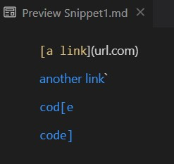
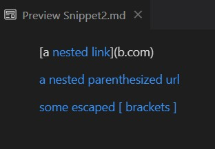
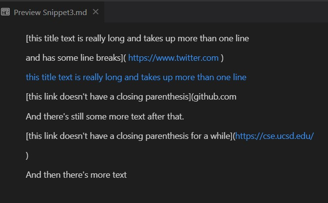
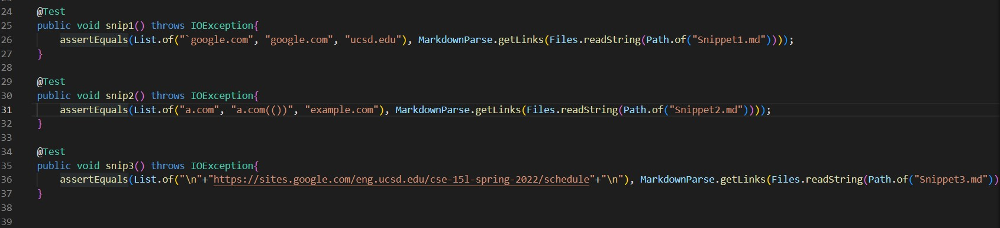
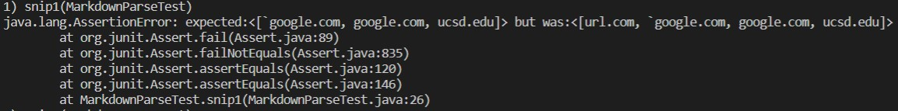
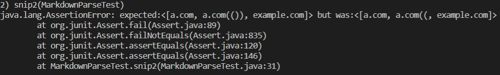

# Lab Report 4

*Edwin Ambrosio*

*28 May 2022*

## Report
***
> A link to your markdown-parse repository and a link to the one you reviewed in week 7

Click [here](https://github.com/mikayladalton2/markdown-parser)

> Decide on what it should produce (i.e., expected output) by using VScode preview

**Snippet 1:**

**Snippet 2:**

**Snippet 3:**

> Showing the code in MarkdownParseTest.java for how you turned it into a test

> For your implementation, the corresponding output when running the tests; if it passed, say so. If it didn’t pass, show the specific part of the JUnit output that shows the test failure.

**Snippet 1:** Fail

**Snippet 2:** Fail

**Snippet 3:** Pass

> For the implementation you reviewed in Week 7, the corresponding output when running the tests; if it passed, say so. If it didn’t pass, show the specific part of the JUnit output that shows the test failure.

The MarkdownParseTest file for the reviewed Repository does not work, they do not have the lib folder so their import statements and javac does do not work. So the files for Snippets 1-3 did not run because the MarkdownParseTest.java did not work.

## Questions
***

> Do you think there is a small (<10 lines) code change that will make your program work for snippet 1 and all related cases that use inline code with backticks? If yes, describe the code change. If not, describe why it would be a more involved change.

Yes. The code change would have to look for ` symbols and skip any [] or () inside of the inline code since it does not count for links.

> Do you think there is a small (<10 lines) code change that will make your program work for snippet 2 and all related cases that nest parentheses, brackets, and escaped brackets? If yes, describe the code change. If not, describe why it would be a more involved change.

No. I don't think a change like that would be a small code fix. Something like that would require a lot of nested loops and if statements to make sure it works for every case and doesn't accidentally skip any cases where the nest [] or () are valid.

>If your code already works on some/all test cases, include an explanation of what were the code changes that allowed the tests to pass.

For Snippet 3, I added one small change that checks for a loop through line skips that prevents the code from breaking or adding wrong links into the List. This allowed my MarkdownParseTester to produce the actual output of just one link.